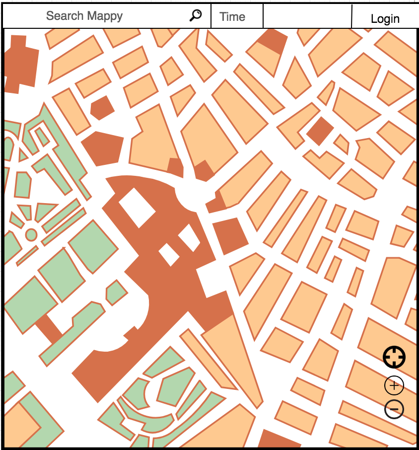

# Background and Overview

“Roamy” is an interactive map application, based on the concept of MoneyMile, that allows users to see a defined area where they can go on a given time frame. The area will be impacted by current traffic conditions, construction, weather, and other factors . This allows people to drop pins on any location and have a visual representation of places are within reach according to the time they have available.

# Features
* General
    1. Display visual cloud of area reachable within given time frame
    2. Get current location
    3. Search Places Information
    4. Find place in Google Maps

* Logged In Users
    1. Track favorite places
    2. Display favorite places inside visual cloud


# Technologies and Technical Challenges

1. MongoDB
2. Express
3. React/ Redux
4. Node.js
5. Google Maps Distance Matrix API 
6. Google Maps Places API
7. Google Maps Geocoder API

* **Integrating Google Maps:** 
    * Google maps currently provides a distance matrix service where it computes multiple start and end point travel times and distances. This utility allows us to determine how long and far it takes to reach multiple endpoints with a single API call.
* **Constructing the Travel Cloud:**
    * The determined area of travel based on time will have to be based on the given roads and current traffic situation. We will use a (generic latitude/longitude change per minute ) scale to generate the first Google Maps Distance Matrix call. 
    * We will then adjust our API calls accordingly based on the return time of each endpoint vs the time available to the User. We will then adjust each respective endpoint until each of our endpoints is less than or equal to the user request time.
    * Natural barriers such as deserts parks and water will have to be taken into consideration.

    ```js
     updatePolygon = (endPoints) => {
        this.polygon = new this.props.google.maps.Polygon({paths: endPoints});
        this.polygonComponent =
            <Polygon
                paths={endPoints}
                strokeColor="#0000FF"
                strokeOpacity={0.8}
                strokeWeight={2}
                fillColor="#0000FF"
                fillOpacity={0.35}
                clickable={false} />;
        }
    ```
* **Google Search Places**
    * Utilized Google Maps Places API to allow users to search places and display place user is looking for in Google Maps
    ```js
    queryPlaces() {
        if (this.state.map && this.state.query !== "") {
        let request = {
            location: this.state.map.getCenter(),
            radius: "500",
            query: this.state.query
        };
        let that = this;

        function returnPlaces(results, status) {
            if (status == that.props.google.maps.places.PlacesServiceStatus.OK)
            that.setState({ queryPlaces: results }) 
        }

        this.state.service.textSearch(request, returnPlaces);
        }
    }
    ```
* **UX**
    * The Frontend will display a large google maps with a nav-bar at the top
    * There will be a simple input form that can take in an integer for time and a location. Users can drop a pin to enter a location as well. 
    * A Login button will be available which will display a dropdown auth page (or modal)
    * On enter of a search request, it will render a shape cloud displaying the range.

    
    


